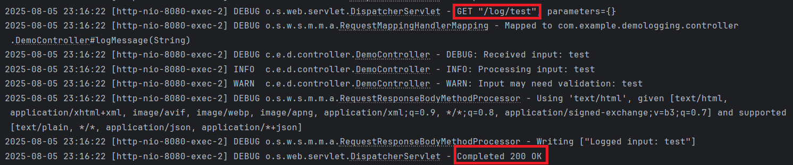

# Demo Logging với Spring Boot

Đây là một ứng dụng Spring Boot đơn giản thể hiện cách sử dụng logging với SLF4J và Logback. Dự án demo các mức log (DEBUG, INFO, WARN, ERROR) và ghi log ra console cũng như file.

## Yêu cầu

- Java 17 hoặc 24
- Maven 3.8.x hoặc cao hơn

## Cấu trúc dự án

- **pom.xml**: File cấu hình Maven với dependency Spring Boot Starter Web (bao gồm SLF4J và Logback).
- **demoLogging.java**: Lớp chính khởi động ứng dụng Spring Boot.
- **controller/DemoController.java**: Controller với các endpoint để demo logging ở các mức khác nhau.
- **logback-spring.xml**: File cấu hình Logback để định dạng và xuất log ra console và file.

## Cách chạy

1. Tải hoặc sao chép dự án.
2. Đảm bảo cấu trúc thư mục đúng:
   ```
   src/main/java/com/example/demologging/
   ├── demoLogging.java
   ├── controller/
   │   ├── DemoController.java
   src/main/resources/
   ├── logback-spring.xml
   pom.xml
   README.md
   ```
3. Truy cập các endpoint để kích hoạt logging:
   - `http://localhost:8080/log/test`: Ghi log với input là `test`.
   - `http://localhost:8080/log/error`: Ghi log lỗi với một exception.

## Các endpoint

- `/log/{input}`: Ghi log ở các mức DEBUG, INFO, WARN, và ERROR (nếu input là "error").
- `/log/error`: Ghi log lỗi với stack trace của một exception.

## Kết quả Logging


