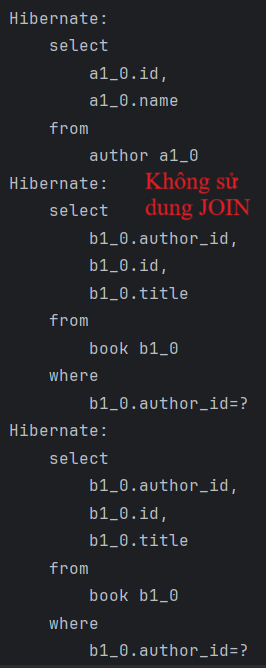
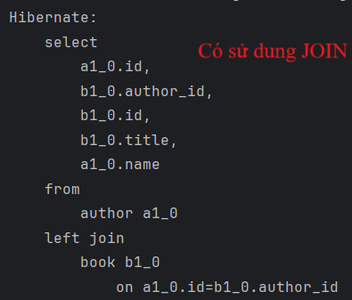

# Demo Giải Quyết N+1 Query với JOIN trong Spring Boot

Đây là một ứng dụng Spring Boot đơn giản thể hiện vấn đề N+1 query trong JPA và cách giải quyết bằng cách sử dụng `LEFT JOIN FETCH`. Dự án sử dụng H2 database in-memory để đơn giản hóa.

## Cấu trúc dự án

- **pom.xml**: File cấu hình Maven với các dependency cho Spring Boot, Spring Data JPA và H2 database.
- **DemoApplication.java**: Lớp chính khởi động ứng dụng Spring Boot.
- **entity/Author.java**: Entity đại diện cho tác giả, có quan hệ One-to-Many với Book.
- **entity/Book.java**: Entity đại diện cho sách, có quan hệ Many-to-One với Author.
- **repository/AuthorRepository.java**: Repository chứa các truy vấn demo N+1 và JOIN.
- **controller/DemoController.java**: Controller với các endpoint để kiểm tra N+1 query và giải pháp JOIN.
- **DataInitializer.java**: Khởi tạo dữ liệu mẫu (2 tác giả, 3 sách).
- **application.properties**: Cấu hình H2 database và hiển thị log SQL.

## Cách chạy

1. Tải hoặc sao chép dự án.
2. Đảm bảo cấu trúc thư mục đúng:
   ```
   src/main/java/com/example/demo/
   ├── DemoApplication.java
   ├── entity/
   │   ├── Author.java
   │   ├── Book.java
   ├── repository/
   │   ├── AuthorRepository.java
   ├── controller/
   │   ├── DemoController.java
   ├── DataInitializer.java
   src/main/resources/
   ├── application.properties
   pom.xml
   README.md
   ```
3. Truy cập các endpoint để kiểm tra:
   - `http://localhost:8080/nplusone`: Demo vấn đề N+1 query.
   - `http://localhost:8080/join`: Demo giải pháp với LEFT JOIN FETCH.

## Các endpoint

- `/nplusone`: Tải tất cả tác giả và sách của họ, gây ra N+1 query (1 truy vấn cho Author + N truy vấn cho Books).
- `/join`: Tải tất cả tác giả và sách trong một truy vấn duy nhất sử dụng LEFT JOIN FETCH.

## Kết quả

- **N+1 Query** (`/nplusone`): Trong console, có 1 truy vấn SELECT cho Author và thêm N truy vấn SELECT cho Books của mỗi Author (tổng cộng 3 truy vấn với dữ liệu mẫu).
  
- **JOIN Fetch** (`/join`): Chỉ có 1 truy vấn SELECT duy nhất với `LEFT JOIN`, tải đồng thời Author và Books.
  
